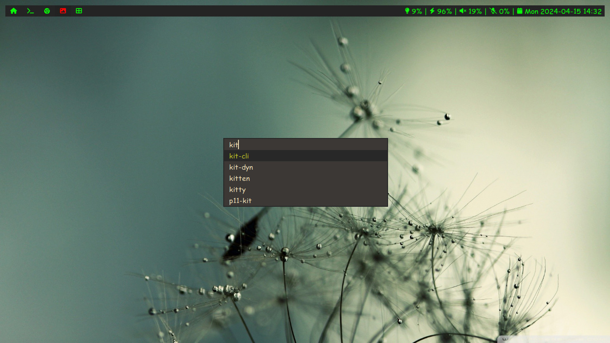

# Table of content:

- [Applied Patches](#applied-patches)
- [Dependencies](#dependencies)
- [Configuration](#configuration)
- [Installation](#installation)



### Applied Patches

- [border](https://tools.suckless.org/dmenu/patches/border): This patch adds a border around the dmenu window. It is intended to be used with the center or xyw patches, to make the menu stand out from similarly coloured windows.

- [caseinsensitive](https://tools.suckless.org/dmenu/patches/case-insensitive): This patch changes case-insensitive item matching to default behaviour. Adds an -s option to enable case-sensitive matching.

- [center](https://tools.suckless.org/dmenu/patches/center): This patch centers dmenu in the middle of the screen.

### Dependencies

In order to build dmenu you need the Xlib header files.

- libxcb
- Xlib-libxcb
- xcb-res
- libxinerama
- libx11
- libxft

### Configuration

Edit `config.mk` to match your local setup (dmenu is installed into the /usr/local namespace by default).

The configuration of dmenu is done copying [config.def.h](config.def.h) to `config.h`, editing it and then (re)compiling the source code.

### Installation

1. Install all the required [dependencies](#dependencies).

2. Copy required fonts to fonts directory.

```
sudo cp -r ComicSansMS /usr/share/fonts/
sudo cp -r Font-Awesome /usr/share/fonts/
```

3. Install dmenu.

```
sudo make install
```

**If you want my bar and dwm, checkout my my build of [dwmblocks](https://github.com/whoisyoges/dwmblocks) and [dwm](https://github.com/whoisyoges/dwm).**
